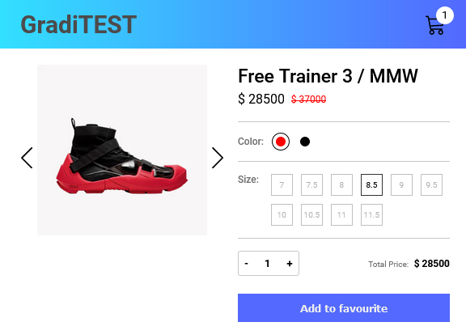
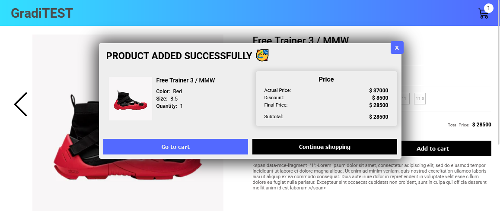

# GradiTEST - Prueba técnica para la empresa Gradiweb

Proyecto desarrollado mediante [Create React App](https://create-react-app.dev/).

Se realizó la maquetación de una ficha de producto de acuerdo al 
consumo de una data de un endpoint proporcionado, realizando un carrusel y 
su respectivo responsive para los distintos tipos de dispositivos, además 
de realizar la maquetación de una ventana modal con funcionalidad para la
acción de **añadir al carrito**.

### Endpoint: 
https://graditest-store.myshopify.com/products/free-trainer-3-mmw.js

El proyecto fue desarrollado bajo las siguientes tecnologías y librerías:

* [x] **HTML5**
* [x] **CSS3**
* [x] **JavaScript**
* [x] **React.js**

## Scripts

Para colocar en marcha el proyecto en ambiente local, se procede a correr el
comando: 

### `npm start`

En el momento de cargar el proyecto, abrir [http://localhost:3000](http://localhost:3000) 
en el navegador.

## Capturas

### Fichas de Producto

#### Mobile

#### Tablet

#### Desktop

### Ventana Modal

#### Mobile

#### Tablet

#### Desktop

